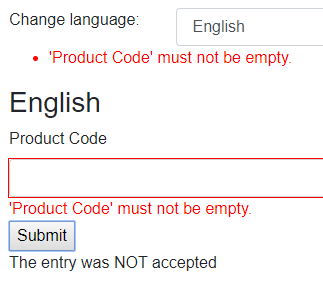
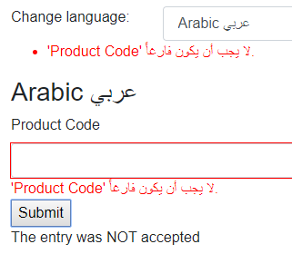
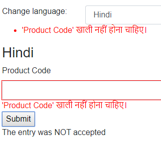

# BlazorValidationLocalization

Demonstrates localisation (sic!) or localization of validation messages for Blazor forms.

Written as an alternative answer for [this StackOverflow question](https://stackoverflow.com/questions/59033230/how-to-add-viewmodel-localization-to-blazor), 
it demonstrates using FluentValidation to add localization support to validation messages.

## Background 

Blazor supports a default `DataAnnotationsValidator` component, but this means closely binding the messages to the model code, and 
is therefore difficult to adapt for localization. 

[FluentValidation](https://fluentvalidation.net/localization) provides an answer since it actually has built-in localization support
and the validation logic is separated from the actual model, making it easier to customize. Better still it already has localized 
messages for built-in components.

I created a very simple Blazor client app with a model class `ProductViewModel`, and added the FluentValidation library to it and created
a validation class `ProductViewModelValidator`:
```cs
  public class ProductViewModelValidator : AbstractValidator<ProductViewModel>
  {
      public ProductViewModelValidator()
      {

          RuleFor(vm => vm.ProductCode).NotEmpty();
      }
```

In a regular application context FluentValidation will use the current culture - 
however for demonstration purposes I wanted to select the language - and FluentValidation supports that too:
```cs
    ValidatorOptions.LanguageManager.Culture = new CultureInfo(language);
```

I also copied [Chris Sainty's](https://chrissainty.com) validation sample to create the `FluentValidationValidator` 
component that replaces the standard `DataAnnotationsValidator`

For testing purposes I built a list of languages and let the user select. You select the language and click submit:

  

Acknowledgements/sources:

 - The [FluentValidation library](https://fluentvalidation.net)
 - [Steve Sanderson's blog](https://blog.stevensanderson.com/2019/09/04/blazor-fluentvalidation/)
 - [Chris Sainty's blog](https://chrissainty.com/using-fluentvalidation-for-forms-validation-in-razor-components/)
 
